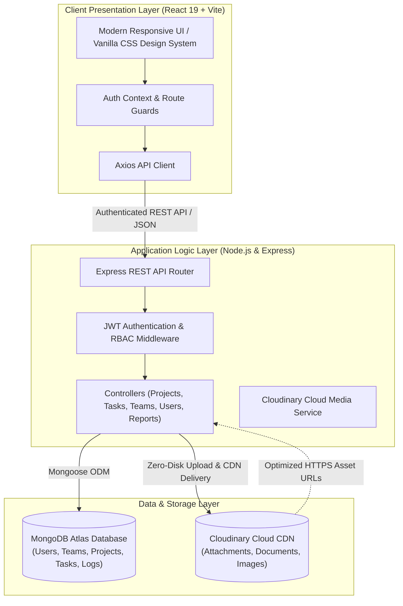

# TaskFlow Pro

<p align="center">
  
</p>

<p align="center">
  <strong>Enterprise-Grade Role-Based Project & Workflow Management System</strong>
  <br />
  <em>Engineered for the <strong>Dainik Jagran Project</strong> — Digital Operations & Workflow Coordination</em>
</p>

<p align="center">
  
  
  
  
  
  
</p>

---

## 📌 Executive Overview

In fast-paced, high-volume news and digital publishing environments like **Dainik Jagran**, editorial desks, regional bureaus, digital teams, and operations require an agile, structured, and auditable workflow platform.

**TaskFlow Pro** provides an end-to-end workflow and task management architecture engineered to streamline project pipelines, coordinate cross-functional teams, track milestone deadlines, and manage digital media assets with strict **Role-Based Access Control (RBAC)**.

---

## 🏛️ System Architecture

TaskFlow Pro is architected as a high-performance decoupled fullstack application backed by MongoDB Atlas, Node.js/Express REST micro-services, and Cloudinary edge media storage:



---

## 👥 Role-Based Access Control (RBAC) Architecture

TaskFlow Pro establishes clear operational boundaries to ensure data governance and focused execution across three distinct organizational roles:

| Capability / Permission | 🛡️ Administrator | 👔 Project Manager / Bureau Lead | 💻 Team Member / Contributor |
| :--- | :---: | :---: | :---: |
| **User Management** (Add, edit, deactivate accounts, assign roles) |  Full Access | ❌ Denied | ❌ Denied |
| **Bureau / Team Management** (Create teams, assign managers) |  Full Access | ❌ Denied | ❌ Denied |
| **Project Creation & Allocation** |  Full Access | ❌ Denied | ❌ Denied |
| **Task Creation & Member Dispatch** |  Full Access |  Assigned Projects | ❌ Denied |
| **Task Execution & Status Workflow** |  Full Access |  Assigned Projects |  Assigned Tasks |
| **Cloud Media & Document Attachments** |  Full Access |  Assigned Projects |  Assigned Tasks |
| **Threaded Comments & Discussions** |  Full Access |  Assigned Projects |  Assigned Tasks |
| **Executive Reports & PDF Generation** |  Workspace-Wide |  Project-Scoped | ❌ Denied |
| **Live Activity & Audit Feed** |  All Operations |  Project-Filtered |  Personal Activity |

> Architectural role flows, permission states, and life-cycle diagrams are maintained in [`docs/role-based-app-flow.md`](docs/role-based-app-flow.md) and [`docs/taskflow-role-workflow.svg`](docs/taskflow-role-workflow.svg).

---

## 🚀 Key Platform Capabilities

### 1. Dynamic Editorial & Task Kanban Board
- Intuitive state transitions across `To Do`, `In Progress`, `In Review`, and `Completed`.
- Real-time priority labeling (`Low`, `Medium`, `High`, `Critical`).
- Deadline indicators with overdue tracking and calendar views.

### 2. Automated Progress Calculation
- Project progress is calculated deterministically from underlying task completion.
- Eliminates manual estimation errors and keeps dashboards synchronized with real progress.

### 3. Cloud-Powered Media & Document Attachments
- Backed by **Cloudinary Cloud Media Storage**: attachments (PDF briefs, Word documents, PNG/JPG photos) are delivered via a global CDN.
- Offloads binary blobs from MongoDB Atlas, ensuring fast queries and zero database bloat.
- Features resilient zero-downtime fallback for offline development.

### 4. Real-time Activity Feeds & Audit Trail
- Automated logging of critical actions: task reassignments, status shifts, team modifications, and new assets.
- Provides complete accountability across regional bureaus and digital desks.

### 5. Automated PDF Executive Reports
- Generates publication-ready PDF summaries of projects, team productivity, and completion metrics powered by PDFKit.

---

## 📁 Clean Repository Structure

```
TaskFlow/
├── Backend/                    # Express REST API
│   ├── config/                 # Database, CORS, Cloudinary, Env loaders
│   │   ├── cloudinary.js       # Cloudinary media SDK integration
│   │   ├── cors.js             # Cross-origin policy configuration
│   │   ├── database.js         # MongoDB connection lifecycle manager
│   │   └── env.js              # Production environment variable auditor
│   ├── controllers/            # Core business logic handlers
│   │   ├── authController.js   # Authentication, verification, login
│   │   ├── projectController.js# Project lifecycle & team associations
│   │   ├── taskController.js   # Tasks, Kanban & Cloudinary attachments
│   │   └── teamController.js   # Teams & member assignments
│   ├── middleware/             # JWT authentication & RBAC guards
│   ├── models/                 # Mongoose schemas (Task, Project, User, etc.)
│   ├── routes/                 # Express API routing tables
│   ├── scripts/                # Database migrations & demo seeders
│   │   ├── create-admin-user.js
│   │   ├── migrate-projects.js
│   │   ├── seed-default-users.js
│   │   └── seed-sample-workspace.js # Pre-populates workspace data
│   ├── utils/                  # Permission helpers & email tools
│   ├── .env.example            # Environment configuration template
│   ├── package.json            # Backend dependencies & npm scripts
│   └── server.js               # Application bootstrap
│
├── Frontend/                   # React 19 + Vite Application
│   ├── public/                 # Static assets, icons, and redirects
│   ├── src/
│   │   ├── app/                # Route definitions & navigation configs
│   │   ├── components/         # Reusable UI components, modals, widgets
│   │   ├── context/            # AuthContext & session state management
│   │   ├── pages/              # Role dashboards, tasks, projects, settings
│   │   ├── services/           # Axios HTTP client endpoints
│   │   └── styles/             # Modular CSS stylesheets & design tokens
│   ├── .env.example            # Frontend environment template
│   ├── index.html              # SPA entry point with SEO metadata
│   ├── package.json            # Frontend dependencies & Vite scripts
│   └── vite.config.js          # Build configuration & local API proxy
│
├── docs/                       # Technical & Architectural Documentation
│   ├── rebuild-architecture.md # Core architectural blueprint
│   ├── role-based-app-flow.md  # Detailed RBAC application flow & states
│   ├── taskflow-role-workflow.svg # SVG workflow diagram
│   └── screenshots/            # Visual previews for documentation
│       ├── login-preview.png
│       └── signup-preview.png
│
├── shared/
│   └── projectConfig.json      # Shared branding and app-level metadata
├── .gitignore                  # Enterprise-grade git ignore rules
├── LICENSE                     # ISC License
├── netlify.toml                # Netlify SPA deployment configuration
└── package.json                # Monorepo orchestration scripts
```

---

## ⚡ Quick Start Guide

### Prerequisites
- **Node.js** (v18.0.0 or higher)
- **MongoDB** (Local instance or MongoDB Atlas connection string)
- **Cloudinary Account** (Optional for cloud media uploads)

---

### 1. Clone the Repository
```bash
git clone https://github.com/yashika-1406/TaskFlow.git
cd TaskFlow
```

### 2. Install Dependencies
Run the workspace installer from the root directory:
```bash
npm run install:all
```

---

### 3. Environment Setup

#### Backend (`Backend/.env`)
Copy the environment template:
```bash
cp Backend/.env.example Backend/.env
```
Configure your environment parameters:
```ini
PORT=5000
NODE_ENV=development
MONGO_URI=mongodb://127.0.0.1:27017/taskflow
JWT_SECRET=your_long_random_jwt_secret_key_here

# Cloudinary Integration (Media & Document Storage)
CLOUDINARY_CLOUD_NAME=your_cloud_name
CLOUDINARY_API_KEY=your_api_key
CLOUDINARY_API_SECRET=your_api_secret

CLIENT_URL=http://localhost:5173
BACKEND_URL=http://localhost:5000
```

#### Frontend (`Frontend/.env.development`)
```ini
VITE_API_URL=/api
```

---

### 4. Seed Demo Workspace Data
To immediately populate the system with pre-configured users, teams, projects, and active tasks:
```bash
npm run seed:sample
```

#### 🔑 Pre-Configured Test Credentials:
| Role | Email | Password | Access Scope |
| :--- | :--- | :--- | :--- |
| **Administrator** | `admin@taskflow.local` | `Admin@12345` | Complete platform control, user/team/project administration |
| **Project Manager** | `pm@taskflow.local` | `Manager@12345` | Project monitoring, task dispatching, reports |
| **Team Member** | `member@taskflow.local` | `Member@12345` | Assigned tasks execution, media file uploads, comments |

---

### 5. Launch the Application

```bash
# Terminal 1: Start Backend API (Port 5000)
npm run dev:backend

# Terminal 2: Start Frontend Application (Port 5173)
npm run dev:frontend
```

Access the application in your browser: [http://localhost:5173](http://localhost:5173)

---

## 📡 REST API Reference

| Method | Endpoint | Description | Scope |
| :--- | :--- | :--- | :--- |
| `POST` | `/api/auth/register` | User account registration | Public |
| `POST` | `/api/auth/login` | User authentication & JWT generation | Public |
| `POST` | `/api/auth/google` | Google OAuth single sign-on | Public |
| `GET` | `/api/projects` | Fetch projects (filtered by role) | Authenticated |
| `POST` | `/api/projects` | Create a new project | Admin only |
| `GET` | `/api/projects/:id` | Fetch full project details & members | Project Members |
| `POST` | `/api/tasks` | Create task and assign to member | PM / Admin |
| `PUT` | `/api/tasks/:id/status` | Update task workflow status | Assignee / PM / Admin |
| `POST` | `/api/tasks/:id/attachments` | Upload media attachment to Cloudinary | Project Members |
| `POST` | `/api/tasks/:id/comments` | Post discussion comment to task | Project Members |
| `GET` | `/api/teams` | List operational teams & members | PM / Admin |
| `POST` | `/api/teams` | Create new operational team | Admin only |
| `GET` | `/api/reports/workspace` | Export workspace metrics & PDF | PM / Admin |

---

## 🖼️ Application Preview

<table align="center" width="100%">
  <tr>
    <td width="50%" align="center">
      <strong>Authentication & Portal Entry</strong><br/>
      
    </td>
    <td width="50%" align="center">
      <strong>User Registration</strong><br/>
      
    </td>
  </tr>
</table>

---

## 🏆 Project Information

- **Project**: Dainik Jagran Project — Digital Operations & Workflow Management
- **Repository**: [https://github.com/yashika-1406/TaskFlow.git](https://github.com/yashika-1406/TaskFlow.git)
- **Maintainer**: Yashika & Project Team

---

## 📄 License
This project is licensed under the [ISC License](LICENSE).
