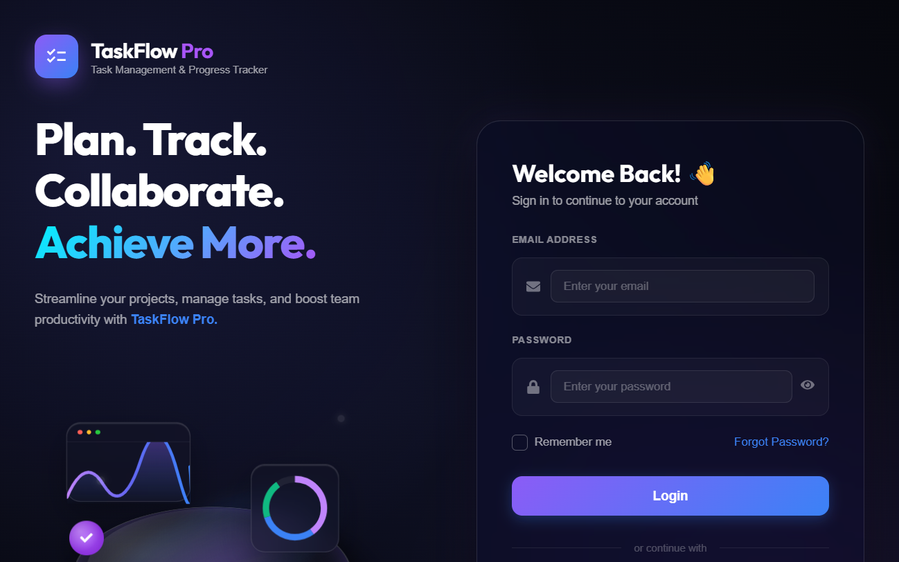
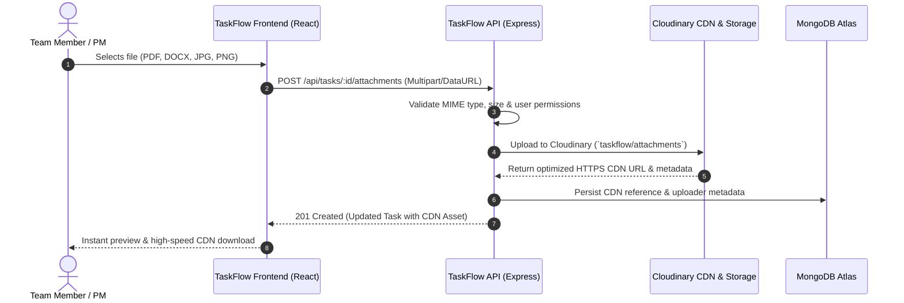
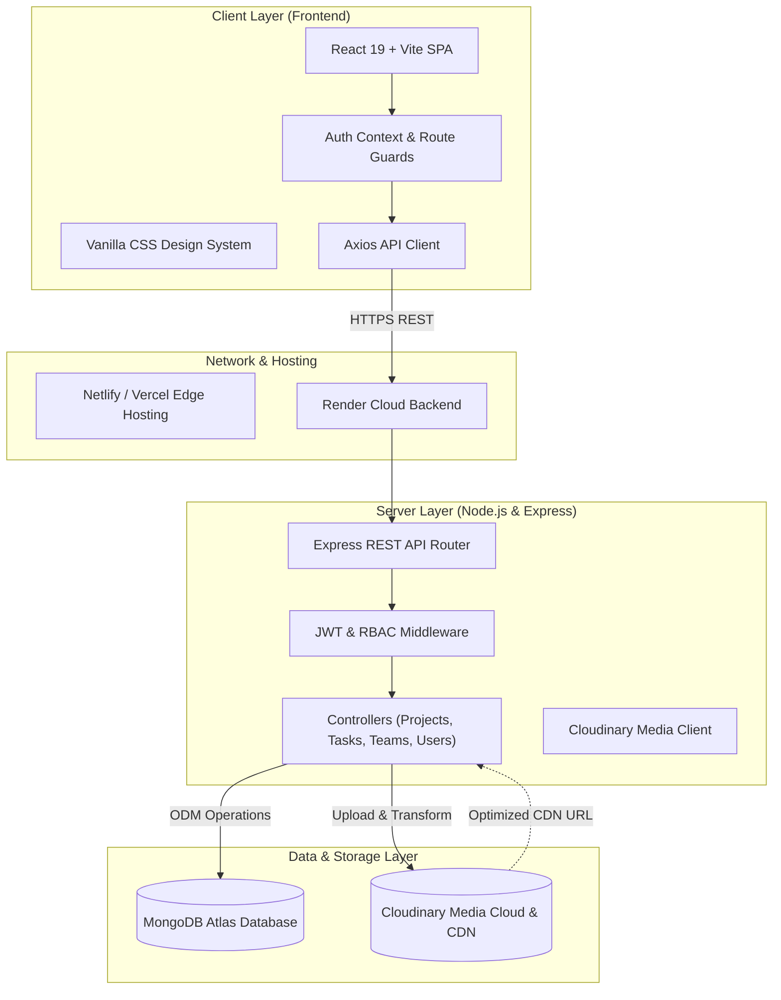
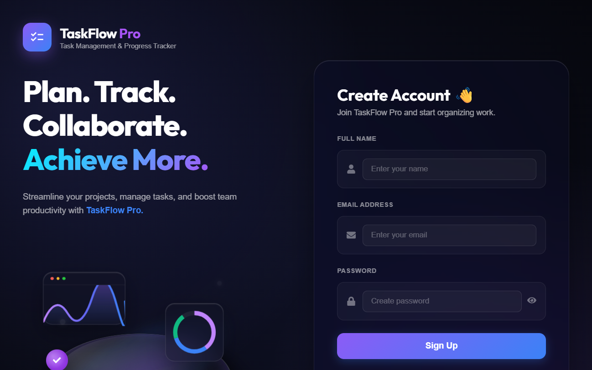

# TaskFlow Pro

<p align="center">
  
</p>

<p align="center">
  <strong>Next-Generation Role-Based Project & Task Management Platform with Cloud-Powered Media Delivery</strong>
  <br />
  <em>Engineered for the National Level Hackathon — <strong>HackIndia (Cloudinary Track)</strong></em>
</p>

<p align="center">
  
  
  
  
  
  
</p>

---

## 📌 Executive Summary

Modern engineering and product teams struggle with fragmented task management, chaotic asset sprawl, and ambiguous ownership boundaries. **TaskFlow Pro** solves this by uniting strict 3-tier **Role-Based Access Control (RBAC)**, automated workflow metrics, real-time activity tracking, and enterprise **Cloudinary Cloud Media Management** into a single cohesive platform.

Built from the ground up for high reliability and scale, TaskFlow Pro separates responsibilities across **Administrators**, **Project Managers**, and **Team Members**, ensuring that team execution remains focused, transparent, and auditable.

---

## 🚀 HackIndia Cloudinary Track Integration

TaskFlow Pro leverages **Cloudinary's Developer Media Platform** to handle project attachments, technical specs, bug screenshots, and documents (PDF, DOC, DOCX, JPG, PNG):



### Key Cloudinary Advantages in TaskFlow Pro:
1. **Zero Database Bloat**: Offloads heavy binary payloads from MongoDB, keeping database documents lean and queries fast.
2. **Global CDN Edge Delivery**: Team members access specs, mockups, and attachments with sub-second global latency.
3. **Multi-Format Media Optimization**: Automatically handles diverse formats (`application/pdf`, `msword`, `image/png`, `image/jpeg`).
4. **Resilient Fallback Design**: If offline or running without Cloudinary keys, the backend gracefully falls back to direct payload handling without blocking workflows.

---

## 👥 Role-Based Access Control (RBAC) Architecture

TaskFlow Pro implements a rigorous permission matrix across three distinct operational roles:

| Feature / Permission | 🛡️ Administrator | 👔 Project Manager | 💻 Team Member |
| :--- | :---: | :---: | :---: |
| **User Management** (Create, update, toggle status) |  Full Access | ❌ Denied | ❌ Denied |
| **Team Management** (Create teams, assign leads) |  Full Access | ❌ Denied | ❌ Denied |
| **Project Creation & Deletion** |  Full Access | ❌ Denied | ❌ Denied |
| **Project Manager Assignment** |  Full Access | ❌ Denied | ❌ Denied |
| **Task Creation & Member Dispatch** |  Full Access |  Assigned Projects | ❌ Denied |
| **Task Execution & Status Updates** |  Full Access |  Assigned Projects |  Assigned Tasks |
| **Cloudinary Attachment Uploads** |  Full Access |  Assigned Projects |  Assigned Tasks |
| **Comments & Discussion Threads** |  Full Access |  Assigned Projects |  Assigned Tasks |
| **Workspace & PDF Report Export** |  Workspace-Wide |  Project-Scoped | ❌ Denied |
| **System-wide Analytics & Metrics** |  Full View |  Filtered View |  Personal View |

> Detailed role documentation and state machines are located in [`docs/role-based-app-flow.md`](docs/role-based-app-flow.md) and [`docs/taskflow-role-workflow.svg`](docs/taskflow-role-workflow.svg).

---

## 💡 Core Features

- 📊 **Dynamic Role-Centric Dashboards**: Tailored views for Admins, Project Managers, and Members featuring live metrics, task completion distributions, and upcoming deadlines.
- 📈 **Automated Progress Calculation**: Project progress is dynamically calculated directly from completed tasks—eliminating manual, inaccurate reporting.
- 🗂️ **Interactive Kanban Board & Task Cards**: Real-time status movement across `To Do`, `In Progress`, `In Review`, and `Completed`.
- 📎 **Cloudinary Cloud Media Attachments**: Seamless file uploads with preview and secure CDN delivery.
- 💬 **Collaboration & Discussions**: Threaded comments and replies attached directly to individual task contexts.
- 📄 **Automated PDF Report Generation**: Export enterprise-grade workspace and project completion summaries via PDFKit.
- 🔔 **Activity Feed & Audit Logging**: Track all actions—task status shifts, team additions, project updates—for complete visibility.
- 🔐 **Dual Auth Support**: JWT authentication with bcrypt password hashing + Google OAuth 2.0 integration.

---

## 🏛️ System Architecture



---

## 📁 Repository Structure

```
TaskFlow/
├── Backend/                    # Express REST API
│   ├── config/                 # Database, CORS, Cloudinary, Env loaders
│   │   ├── cloudinary.js       # Cloudinary SDK configuration
│   │   ├── cors.js             # Cross-Origin Resource Sharing policy
│   │   ├── database.js         # MongoDB connection lifecycle
│   │   └── env.js              # Environment variable verification
│   ├── controllers/            # Business logic handlers
│   │   ├── authController.js
│   │   ├── projectController.js
│   │   ├── taskController.js   # Task management & Cloudinary attachments
│   │   └── teamController.js
│   ├── middleware/             # JWT auth & RBAC route protection
│   ├── models/                 # Mongoose data schemas (Task, Project, User, etc.)
│   ├── routes/                 # Express API routes
│   ├── scripts/                # Database migrations and seeding utilities
│   │   ├── create-admin-user.js
│   │   ├── migrate-projects.js
│   │   ├── seed-default-users.js
│   │   └── seed-sample-workspace.js # Seeds demo data for hackathon judges
│   ├── utils/                  # RBAC permissions & email validators
│   ├── .env.example            # Environment configuration template
│   ├── package.json            # Backend dependencies & npm scripts
│   └── server.js               # Application bootstrap entry point
│
├── Frontend/                   # React 19 + Vite Application
│   ├── public/                 # Static web assets & icons
│   ├── src/
│   │   ├── app/                # Centralized route & navigation configs
│   │   ├── components/         # Reusable UI widgets, modals, layouts
│   │   ├── context/            # Authentication & session providers
│   │   ├── pages/              # Role dashboards, tasks, projects, settings
│   │   ├── services/           # Axios HTTP client endpoints
│   │   └── styles/             # Modular CSS theme and page stylesheets
│   ├── .env.example            # Frontend environment variables template
│   ├── index.html              # Single Page Application root
│   ├── package.json            # Frontend dependencies & Vite scripts
│   └── vite.config.js          # Vite build & proxy settings
│
├── docs/                       # Technical & Architectural Documentation
│   ├── rebuild-architecture.md # Structural rebuild documentation
│   ├── role-based-app-flow.md  # Detailed RBAC application flow & states
│   ├── taskflow-role-workflow.svg # Visual role workflow diagram
│   └── screenshots/            # Showcase images for demonstration
│       ├── login-preview.png
│       └── signup-preview.png
│
├── shared/
│   └── projectConfig.json      # Shared branding and app-level metadata
├── .gitignore                  # Comprehensive root git ignore rules
├── netlify.toml                # Netlify SPA build configuration
└── package.json                # Monorepo orchestration scripts
```

---

## ⚡ Quick Start Guide

### Prerequisites
- [Node.js](https://nodejs.org/) (v18.0.0 or higher)
- [MongoDB](https://www.mongodb.com/) (Local instance or free MongoDB Atlas cluster)
- [Cloudinary](https://cloudinary.com/) (Free account for media storage)

---

### 1. Clone the Repository
```bash
git clone https://github.com/yashika-1406/TaskFlow.git
cd TaskFlow
```

### 2. Install Dependencies
Run the root helper command to install dependencies across both Backend and Frontend:
```bash
npm run install:all
```
*(Or install individually: `cd Backend && npm install`, then `cd ../Frontend && npm install`)*

---

### 3. Configure Environment Variables

#### Backend (`Backend/.env`)
Copy the template and fill in your database and Cloudinary keys:
```bash
cp Backend/.env.example Backend/.env
```
Key variables:
```ini
PORT=5000
NODE_ENV=development
MONGO_URI=mongodb://127.0.0.1:27017/taskflow
JWT_SECRET=your_super_secret_jwt_key_here

# Cloudinary Integration (HackIndia Cloudinary Track)
CLOUDINARY_CLOUD_NAME=your_cloud_name
CLOUDINARY_API_KEY=your_api_key
CLOUDINARY_API_SECRET=your_api_secret

CLIENT_URL=http://localhost:5173
BACKEND_URL=http://localhost:5000
```

#### Frontend (`Frontend/.env.development`)
```ini
VITE_API_URL=/api
```

---

### 4. Seed Demo Data (Instant HackIndia Evaluation)
Populate the database with pre-configured users, teams, projects, tasks, and activity logs:
```bash
npm run seed:sample
```

#### 🔑 Pre-Configured Test Credentials:
| Role | Email | Password | Access Scope |
| :--- | :--- | :--- | :--- |
| **Administrator** | `admin@taskflow.local` | `Admin@12345` | Complete platform control, user/team/project administration |
| **Project Manager** | `pm@taskflow.local` | `Manager@12345` | Project monitoring, task dispatching, reports |
| **Team Member** | `member@taskflow.local` | `Member@12345` | Assigned tasks execution, Cloudinary file uploads, comments |

---

### 5. Run the Application

In separate terminal windows (or using your preferred terminal manager):

```bash
# Terminal 1: Start Backend (Port 5000)
npm run dev:backend

# Terminal 2: Start Frontend (Port 5173)
npm run dev:frontend
```

Open [http://localhost:5173](http://localhost:5173) in your browser.

---

## 📡 REST API Reference

| Method | Endpoint | Description | Access |
| :--- | :--- | :--- | :--- |
| `POST` | `/api/auth/register` | Register new user account | Public |
| `POST` | `/api/auth/login` | Authenticate and obtain JWT token | Public |
| `POST` | `/api/auth/google` | Sign in with Google OAuth | Public |
| `GET` | `/api/projects` | List projects (scoped by user role) | Authenticated |
| `POST` | `/api/projects` | Create a new project | Admin only |
| `GET` | `/api/projects/:id` | Fetch project details, tasks & members | Member / PM / Admin |
| `POST` | `/api/tasks` | Create task and assign to member | PM / Admin |
| `PUT` | `/api/tasks/:id/status` | Update task progress status | Assignee / PM / Admin |
| `POST` | `/api/tasks/:id/attachments` | **Upload attachment to Cloudinary** | Project Members |
| `POST` | `/api/tasks/:id/comments` | Add discussion comment to task | Project Members |
| `GET` | `/api/teams` | List teams and assigned members | PM / Admin |
| `POST` | `/api/teams` | Create new operational team | Admin only |
| `GET` | `/api/reports/workspace` | Export workspace metrics & PDF | PM / Admin |

---

## 🖼️ Application Preview

<table align="center" width="100%">
  <tr>
    <td width="50%" align="center">
      <strong>Authentication & Onboarding</strong><br/>
      
    </td>
    <td width="50%" align="center">
      <strong>Team Registration</strong><br/>
      
    </td>
  </tr>
</table>

---

## 🏆 Hackathon Submission Metadata

- **Event**: HackIndia 2026 National Level Hackathon
- **Track**: Cloudinary Developer Track (Cloud Media Management & CDN Delivery)
- **Repository**: [https://github.com/yashika-1406/TaskFlow.git](https://github.com/yashika-1406/TaskFlow.git)
- **Lead Developer**: Yashika & Project Team

---

## 📄 License
This project is licensed under the [ISC License](LICENSE).
