# TaskFlow Final Role-Based Workflow

This document shows the final role-based workflow aligned to the current application behavior and the requirement.

## Roles

- `Administrator`
- `Project Manager`
- `Team Member`

## Final Workflow Chart

```mermaid
flowchart TD
    A[User opens TaskFlow] --> B{Authenticated?}
    B -- No --> C[Login]
    C --> D[JWT token and user session created]
    D --> E[Role-based dashboard]
    B -- Yes --> E

    E --> F{Role}

    F -- Administrator --> G[Administrator Dashboard]
    G --> G1[View total projects]
    G --> G2[View total tasks]
    G --> G3[View completed and pending tasks]
    G --> G4[View team members and project status]
    G --> H[User Management]
    H --> H1[Add user]
    H --> H2[Edit user]
    H --> H3[Delete user]
    H --> H4[Assign role]
    H --> H5[Activate or deactivate user]
    G --> I[Team Management]
    I --> I1[Create team]
    I --> I2[Assign members]
    I --> I3[Assign project manager to team]
    I --> I4[View team performance]
    G --> J[Project Management]
    J --> J1[Create project]
    J --> J2[Assign team to project]
    J --> J3[Edit or delete project]
    J --> J4[Project progress auto-calculated from completed tasks]
    G --> K[Reports and Progress Tracking]
    K --> K1[Project report]
    K --> K2[Employee performance report]
    K --> K3[Pending and completed task reports]
    K --> K4[Monthly progress report]
    G --> L[Settings]
    L --> L1[Manage profile]
    L --> L2[Change password]

    F -- Project Manager --> M[Project Manager Dashboard]
    M --> M1[View assigned projects]
    M --> M2[View today's tasks]
    M --> M3[View pending tasks in managed projects]
    M --> M4[View overdue tasks in managed projects]
    M --> N[Task Management]
    N --> N1[Create task]
    N --> N2[Assign task to team member]
    N --> N3[Edit task]
    N --> N4[Delete task]
    N --> N5[Update task status]
    M --> O[Project Monitoring]
    O --> O1[Monitor team progress]
    O --> O2[View project timeline]
    O --> O3[Review task status mix]
    M --> P[Comments and Attachments]
    P --> P1[Upload PDF DOC DOCX JPG PNG]
    P --> P2[Add comments and replies]
    M --> Q[Reports]
    Q --> Q1[Generate project report]
    Q --> Q2[Generate performance and progress reports]

    F -- Team Member --> R[Team Member Dashboard]
    R --> R1[View assigned tasks only]
    R --> R2[View upcoming deadlines]
    R --> R3[View completed assigned tasks]
    R --> S[Task Work]
    S --> S1[Open assigned task]
    S --> S2[Update task status]
    S --> S3[Add comments]
    S --> S4[Reply to comments]
    S --> S5[Upload PDF DOC DOCX JPG PNG attachments]
    R --> T[Project Visibility]
    T --> T1[View project timeline]
    T --> T2[Track own assigned work]

    J1 --> U[Project created]
    I2 --> U
    U --> V[Project manager creates tasks]
    V --> W[Tasks assigned to team members]
    W --> X[Team members update task status]
    X --> Y[Completed tasks update project progress]
    Y --> Z[Dashboards reports and progress views refresh]
```

## Role Rules Summary

- Administrator controls users, teams, projects, reports, and settings.
- Project Manager works inside assigned projects and manages project tasks and execution.
- Team Member only works on assigned tasks and collaboration items such as comments and attachments.
- Project progress is not manually entered. It is calculated from task completion.
- Team assignment to project is done by the administrator.

## Shared Configuration

Shared app-level configuration is stored in [`shared/projectConfig.json`](../shared/projectConfig.json).
