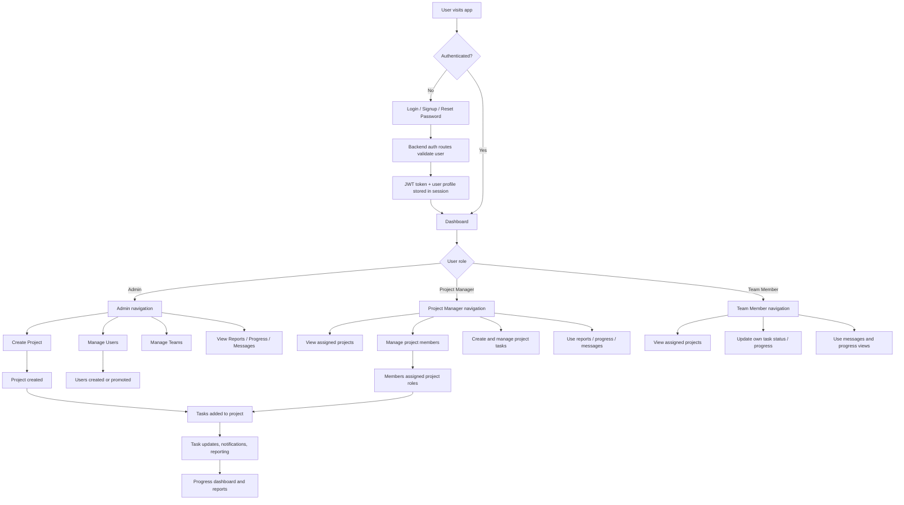

# TaskFlow Role-Based Application Flow

This document explains the current end-to-end application flow using the role-based model implemented in the codebase.

## Roles

- `admin`: manages users, teams, projects, and system-wide access
- `project_manager`: manages assigned projects, members, and project tasks
- `team_member`: works on assigned tasks and participates in project collaboration

## End-to-End Flow

## Access Summary

- Admins can access `/users` and `/teams`
- Admins can create projects from the dashboard and project workflows
- Project managers can manage project-level membership and task operations where assigned
- Team members have limited edit access and are restricted to their own assigned work updates

## Shared Configuration

The shared branding config now lives in [`shared/projectConfig.json`](../shared/projectConfig.json) and is consumed by frontend config helpers and backend admin seeding logic.
